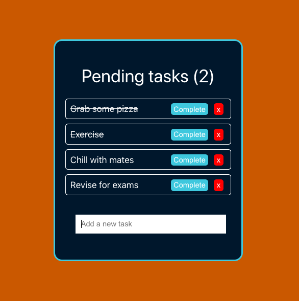

# React Todo Hooks



A simple frontend Todo app built with React, leveraging the React Hooks API. The objective for this project was to educate myself about the React Hooks API.

## Getting started

### Git Clone

To clone the code on your machine and run the program in your local environment, click the Code button above. After downloading it with HTTPS or SSH, run `yarn` in the root level to install dependencies, and `yarn start` to start the server.

## Technologies used
* React
* React Hooks API
* JSX
* Yarn

## Components

I started by writing the `Task` component, which will be called for each instance of a task on the todo. The `Task` component returns some JSX to define what each task element will look like: 

```javascript
function Task({ task, index, completeTask, removeTask }) { //? props being passed in Todo JSX
  return (
    <div
      className="task"
      style={{ textDecoration: task.completed ? "line-through" : "" }} //? inline style for task completion
    >
      {task.title}
      <button style={{ background: "red" }} onClick={() => removeTask(index)}>x</button>
      <button onClick={() => completeTask(index)}>Complete</button>
    </div>
  )
}
```

In the `Todo` component, the `useState` function returns an array with two elements. The first item being the current state value for the tasks and the second being a function that can be used to update the tasks. These are hard coded in to populate the `Todo` but could naturally be updated dynamically. Another instance of `useState`is also used to monitor the amount of incomplete tasks remaining - a new state Hook is registered for the pending tasks in the `Todo` component to update the number of pending tasks whenever the DOM is re-rendered:

```javascript
function Todo() {
  const [tasksRemaining, setTasksRemaining] = useState(0) //* Effect hook to update the state of tasksRemaining when the DOM re-renders
  const [tasks, setTasks] = useState([
    {
      title: "Grab some pizza",
      completed: true
    },
    {
      title: "Exercise",
      completed: true
    },
    {
      title: "Chill with mates",
      completed: false
    }
  ])
```

The methods `addTask`, `completeTask` and `removeTask` handle the adding, completing and removing of each task. They're being defined within the `Todo` component and being passed as props to the `Task` component, which in turn is being called for each individual task in the JSX of `Todo` component, where an instance of the `Task` component is being returned for each element in the tasks array:

```javascript
  return (
    <div className="todo-container">
      <div className="header">Pending tasks ({tasksRemaining})</div>
      <div className="tasks">
        {tasks.map((task, index) => (
          <Task
            task={task}
            index={index}
            completeTask={completeTask}
            removeTask={removeTask}
            key={index}
          />
        ))}
      </div>
      <div className="create-task" >
          <CreateTask addTask={addTask} />
      </div>
    </div>
  )
  ```

Adding a new task happens in the `CreateTask` component. It includes the `handleSubmit` method that handles the form input being created into a new task. `handleSubmit` receives `addTask` as a prop, the input value is being passed down as a prop to `addTask` in order to create a new task to the todo. Finally `CreateTask` returns some JSX where the user can add a new task:

```javascript
  return (
    <form onSubmit={handleSubmit}>
      <input
        type="text"
        className="input"
        value={value}
        placeholder="Add a new task"
        onChange={e => setValue(e.target.value)}
      />
    </form>
  )
```

## Future improvements

* Responsive design